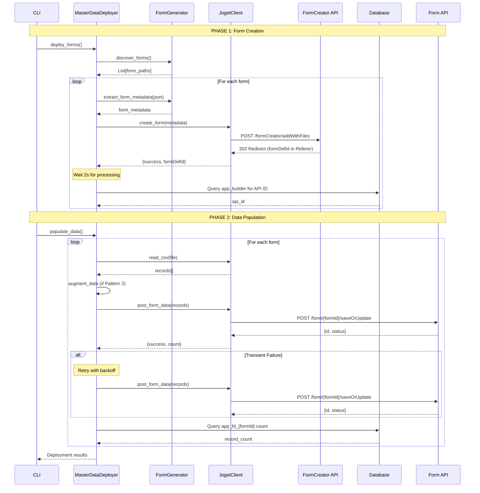

# Joget Utility - Technical Documentation

**Version:** 2.0
**Last Updated:** October 27, 2025
**Status:** Production-Ready with Known Limitations

---

## Table of Contents

1. [Quick Reference](#quick-reference)
2. [Architecture Overview](#architecture-overview)
3. [Deployment Architecture](#deployment-architecture)
4. [Package Structure & Rationale](#package-structure--rationale)
5. [Architectural Patterns](#architectural-patterns)
6. [System Components](#system-components)
7. [Data Processing Pipelines](#data-processing-pipelines)
8. [API Reference](#api-reference)
9. [Configuration System](#configuration-system)
10. [Known Issues & Mitigation](#known-issues--mitigation)
11. [Error Handling & Recovery](#error-handling--recovery)
12. [Logging & Debugging](#logging--debugging)
13. [Security Considerations](#security-considerations)
14. [Performance Optimization](#performance-optimization)
15. [Extension Guide](#extension-guide)
16. [Testing Strategy](#testing-strategy)
17. [Deployment Guide](#deployment-guide)
18. [Glossary](#glossary)
19. [Appendices](#appendices)

---

## Quick Reference

**Goal:** Complete common tasks without reading full documentation or code.

### Deploy All MDM Forms and Data

```bash
# Full deployment (37 forms + 416 records)
cd joget_utility
python joget_utility.py --deploy-master-data --yes

# Forms only (no data population)
python joget_utility.py --deploy-master-data --forms-only

# Data only (assumes forms already exist)
python joget_utility.py --deploy-master-data --data-only
```

**Expected Output:**
```
Phase 1: Creating Forms
  ✓ md01maritalStatus (1/37)
  ✓ md02language (2/37)
  ...
  ✓ md37collectionPoint (37/37)

Phase 2: Populating Data
  ✓ md01maritalStatus: 5 records
  ✓ md02language: 3 records
  ...
  ✓ md37collectionPoint: 12 records

✅ Deployment complete: 37 forms, 416 records
```

---

### Generate Form from CSV

```bash
# Generate single form definition
python joget_utility.py --generate-form data/metadata/md99status.csv

# Output: data/metadata_forms/md99status.json

# Generate all forms in metadata directory
python joget_utility.py --generate-forms-from-csv

# Output: All md*.csv → md*.json in metadata_forms/
```

---

### Verify Deployment

```bash
# Automated verification (recommended)
python verify_deployment.py

# Expected output:
# ✓ Forms: 37/37
# ✓ APIs: 37/37
# ✓ Tables: 37/37
# ✓ Records: 416/416

# Quick SQL verification
mysql -h localhost -P 3308 -u root -p jwdb -e "
  SELECT TABLE_NAME, TABLE_ROWS
  FROM information_schema.TABLES
  WHERE TABLE_NAME LIKE 'app_fd_md%'
  ORDER BY TABLE_NAME
"

# Accurate count (slower)
mysql -h localhost -P 3308 -u root -p jwdb -e "
  SELECT 'md01maritalStatus', COUNT(*) FROM app_fd_md01maritalStatus
  UNION ALL
  SELECT 'md02language', COUNT(*) FROM app_fd_md02language
  -- ... repeat for all forms
"
```

---

### Retry Failed Forms

```python
# Pattern for transient failures (see KNOWN_ISSUES.md)
import time
from pathlib import Path
from processors.master_data_deployer import MasterDataDeployer

# Initialize deployer
deployer = MasterDataDeployer(config=deploy_config, logger=logger)

# Extract form metadata
form_metadata = deployer.extract_form_metadata(json_file)

# Get API ID
api_id = client.get_api_id_for_form(
    app_id='subsidyApplication',
    app_version='1',
    api_name=f"api_{form_id}",
    db_config=db_config
)

if api_id:
    form_metadata['api_id'] = api_id

    # First attempt
    result = deployer.populate_form_data(client, form_metadata, csv_file)

    if not result['success']:
        # Retry immediately (usually works for transient failures)
        print("Retrying...")
        time.sleep(2)
        result = deployer.populate_form_data(client, form_metadata, csv_file)
```

**See:** `test_md30_data.py` for complete example.

---

### Troubleshooting Quick Fixes

| Issue | Symptoms | Quick Fix | Documentation |
|-------|----------|-----------|---------------|
| **API ID not found** | "API ID not found for formX" | Wait 5s and retry query | KNOWN_ISSUES.md |
| **Phantom validation error** | Error references non-existent field | Retry data population immediately | KNOWN_ISSUES.md #issue-2 |
| **Form can't open in builder** | Error when opening form in Joget UI | Drop form and redeploy | KNOWN_ISSUES.md #issue-1 |
| **Parent form missing** | Child form creation fails | Check deployment order (parent before child) | DEPLOYMENT_STRATEGY.md |
| **Table doesn't exist** | Data population fails with table error | Access form in Joget UI to trigger lazy table creation | - |
| **Wrong API called** | HTTP 404 on form creation | Check using FormCreator API, not Form API | API Reference section |

---

### Configuration Files

**Primary Configuration:**
- **MDM Deployment:** `config/master_data_deploy.yaml`
- **Relationships:** `data/relationships.json`
- **Database Credentials:** `.env.3` (NOT in git)

**Data Files:**
- **Form Definitions:** `data/metadata_forms/md*.json`
- **Data Files:** `data/metadata/md*.csv`

**Example .env.3:**
```bash
DB_HOST=localhost
DB_PORT=3308
DB_NAME=jwdb
DB_USER=root
DB_PASSWORD=password
```

---

### Important Documentation for Issues

- **Transient deployment failures:** `KNOWN_ISSUES.md` (5.3% failure rate, retry works)
- **Deployment best practices:** `DEPLOYMENT_STRATEGY.md` (retry patterns, delays)
- **Architecture decisions:** `MD19_MERGE_NOTES.md` (polymorphic table pattern)
- **Deployment results:** `DEPLOYMENT_RESULTS.md` (test outcomes, lessons learned)

---

### Common Commands Reference

```bash
# Test connection
python joget_utility.py --test

# List available endpoints
python joget_utility.py --list

# Dry run (preview without posting)
python joget_utility.py --deploy-master-data --dry-run

# Debug mode (verbose logging)
python joget_utility.py --deploy-master-data --debug

# Validate forms only (no deployment)
python joget_utility.py --deploy-master-data --validate
```

---

## Architecture Overview

### System Design Principles

The Joget Utility follows a **two-phase deployment architecture** with clear separation of concerns:

1. **Phase 1: Form Creation**
   - Creates form definitions in Joget
   - Creates physical database tables
   - Registers API endpoints
   - Creates List/CRUD UIs (optional)

2. **Phase 2: Data Population**
   - Populates created forms with CSV data
   - Handles parent-child relationships
   - Supports polymorphic table patterns
   - Implements retry logic for transient failures

### Key Design Patterns

1. **Two-Phase Deployment**: Separate form structure from data loading
2. **Dual API Architecture**: FormCreator API for forms, Form API for data
3. **Polymorphic Tables**: Single table with sparse columns for hierarchical data
4. **Strategy Pattern**: Different processors for CSV/JSON/metadata
5. **Dependency Injection**: Configuration injected at runtime
6. **Lazy Table Creation**: Physical tables created on first access

### High-Level Architecture Diagram

```
┌────────────────────────────────────────────────────────────┐
│                  Command Line Interface                     │
│                  (joget_utility.py)                        │
└───────────────────────┬────────────────────────────────────┘
                        │
        ┌───────────────┴───────────────┐
        │                               │
┌───────▼──────────┐         ┌─────────▼────────┐
│  Configuration   │         │  Master Data     │
│  Layer           │         │  Deployer        │
│  (utils.py)      │         │  (Two-Phase)     │
└──────────────────┘         └─────────┬────────┘
                                       │
                    ┌──────────────────┼──────────────────┐
                    │                  │                  │
            ┌───────▼────────┐  ┌──────▼──────┐  ┌──────▼───────┐
            │ Form Generator │  │ Joget Client│  │ Data         │
            │ (CSV→JSON)     │  │ (HTTP)      │  │ Augmentor    │
            └────────────────┘  └─────────────┘  └──────────────┘
                                       │
                    ┌──────────────────┴──────────────────┐
                    │                                     │
            ┌───────▼────────┐                   ┌───────▼────────┐
            │ FormCreator API│                   │ Form API       │
            │ (Create Forms) │                   │ (Post Data)    │
            └────────────────┘                   └────────────────┘
```

---

## Deployment Architecture

### Two-Phase Deployment Model

The system uses a **two-phase deployment** approach to separate concerns and enable better error handling.

#### Phase 1: Form Creation

**Purpose:** Create form structures in Joget without data.

**Process:**
```
1. Form Discovery
   └─> Scan data/metadata_forms/ for md*.json

2. Dependency Ordering
   └─> Sort: parent forms before child forms

3. Form Creation (per form)
   ├─> Load JSON definition
   ├─> POST to FormCreator API (multipart/form-data)
   ├─> Extract formDefId from response Referer header
   └─> Joget creates:
       ├─> app_form entry (form definition)
       ├─> app_fd_{formId} table (physical table, lazy)
       ├─> app_builder entry (API endpoint)
       └─> List/CRUD UI (optional)

4. Verification
   ├─> Wait 2s for Joget processing
   └─> Query app_builder for API ID
```

**API Used:** FormCreator API
**Endpoint:** `/jw/api/form/formCreator/addWithFiles`
**Authentication:** FormCreator API key

---

#### Phase 2: Data Population

**Purpose:** Populate created forms with CSV data.

**Process:**
```
1. API ID Discovery
   └─> Query app_builder table for form-specific API ID

2. Data Reading
   ├─> Read CSV file
   └─> Parse into records

3. Relationship Resolution
   ├─> Check data/relationships.json
   └─> Identify parent-child relationships

4. Data Augmentation (if Pattern 2)
   ├─> Load parent form data
   ├─> Extract parent codes
   ├─> Inject FK values into child records
   └─> See: DataAugmentor

5. Data Posting
   ├─> Transform records to form format
   ├─> POST to Form API (form-urlencoded)
   ├─> Retry on transient failures (exponential backoff)
   └─> Collect results

6. Verification
   └─> Query app_fd_{formId} for record count
```

**API Used:** Form API
**Endpoint:** `/jw/api/form/{formId}/saveOrUpdate`
**Authentication:** Form-specific API key

---

### Dual API Architecture

Joget provides **two separate APIs** for different purposes:

#### 1. FormCreator API (Form Creation)

**Purpose:** Create new forms with tables and API endpoints.

**Characteristics:**
- Endpoint: `/jw/api/form/formCreator/addWithFiles`
- Method: POST multipart/form-data
- Authentication: FormCreator API key (one per Joget instance)
- Input: Form JSON definition as file upload
- Output: HTTP 302 redirect with formDefId in Referer header
- Creates: Form + Table + API + CRUD UI

**Use When:**
- Deploying new forms
- Creating form structures
- Setting up API endpoints

**See:** FormCreator Plugin documentation

---

#### 2. Form API (Data Population)

**Purpose:** Submit data to existing forms.

**Characteristics:**
- Endpoint: `/jw/api/form/{formId}/saveOrUpdate`
- Method: POST application/x-www-form-urlencoded
- Authentication: Form-specific API key (one per form)
- Input: Field name-value pairs
- Output: JSON with record ID
- Requires: Form must already exist, API must be created

**Use When:**
- Populating form data
- Submitting individual records
- Batch data insertion

**See:** Joget Form API documentation

---

### Form Lifecycle State Machine

```
[JSON Definition]
      │
      │ FormCreator API POST
      ▼
[Form Created]
      │
      ├─> app_form (definition)
      ├─> app_builder (API endpoint)
      └─> app_fd_{formId} (table, lazy)
      │
      │ First form access in UI
      ▼
[Physical Table Created]
      │
      │ Form API POST
      ▼
[Data Populated]
      │
      └─> Records in app_fd_{formId}
```

**Critical:** Physical table creation is **lazy** - table doesn't exist until:
1. Form accessed in Joget UI, OR
2. First data POST to Form API

---

### Deployment Sequence Diagram



---

## Package Structure & Rationale

### Directory Layout

```
joget_utility/
├── joget_utility.py          # CLI entry point
├── joget_client.py            # HTTP client (dual API support)
├── utils.py                   # Configuration & logging
│
├── processors/                # Data processing modules
│   ├── __init__.py
│   │
│   ├── CORE PROCESSORS (File I/O)
│   ├── base.py               # Abstract base for all processors
│   ├── csv_processor.py      # CSV reading with auto-detection
│   ├── json_processor.py     # JSON reading with flexibility
│   │
│   ├── DEPLOYMENT ORCHESTRATION
│   ├── master_data_deployer.py   # ⭐ TWO-PHASE deployment orchestrator
│   │                              # Phase 1: Form creation
│   │                              # Phase 2: Data population
│   ├── metadata.py            # ⚠️ DEPRECATED: Use master_data_deployer.py
│   │
│   ├── FORM GENERATION
│   ├── form_generator.py     # CSV structure → Joget Form JSON
│   ├── form_discovery.py     # Find and analyze form definitions
│   ├── form_comparator.py    # Compare local vs deployed forms
│   │
│   ├── RELATIONSHIP MANAGEMENT
│   ├── relationship_detector.py   # Detect parent-child relationships
│   ├── nested_lov_fixer.py        # Fix SelectBox structure bugs
│   ├── nested_lov_validator.py    # Validate parent-child integrity
│   │
│   └── DATA TRANSFORMATION
│       └── data_augmentor.py      # Pattern 2 polymorphic table support
│                                  # Injects FK values for child forms
│
├── config/                    # Configuration files
│   └── master_data_deploy.yaml   # MDM deployment config
│
├── data/                      # Data files
│   ├── metadata/              # CSV data files
│   ├── metadata_forms/        # JSON form definitions
│   └── relationships.json     # Parent-child relationship config
│
└── docs/                      # Documentation
    ├── TECHNICAL_DOCUMENTATION.md
    ├── KNOWN_ISSUES.md
    ├── DEPLOYMENT_STRATEGY.md
    └── MD19_MERGE_NOTES.md
```

---

### Why 14 Different Processors?

Each processor has a **single, well-defined responsibility**. Here's why they exist:

#### CORE PROCESSORS

**base.py** - Abstract base class
- **Why:** Defines contract for all processors
- **When to use:** Extend this to create new processor types

**csv_processor.py** - CSV file reading
- **Why:** Handles CSV-specific parsing (delimiters, encoding, BOM)
- **Features:** Auto-detection of delimiter, UTF-8 with BOM, empty row filtering
- **When to use:** Reading CSV data files

**json_processor.py** - JSON file reading
- **Why:** Handles JSON structure flexibility (arrays, nested objects)
- **Features:** Multiple JSON structures, nested object flattening
- **When to use:** Reading JSON data files (not form definitions)

---

#### DEPLOYMENT ORCHESTRATION

**master_data_deployer.py** ⭐ **MOST IMPORTANT**
- **Why:** Orchestrates two-phase deployment (form creation + data population)
- **Responsibilities:**
  - Phase 1: Create forms via FormCreator API
  - Phase 2: Populate data via Form API
  - Coordinate between multiple processors
  - Handle parent-child dependencies
  - Retry logic for transient failures
- **When to use:** `--deploy-master-data` command
- **Example:** See `test_md27_full_deploy.py`

**metadata.py** ⚠️ **DEPRECATED**
- **Why exists:** Legacy batch processor from before two-phase architecture
- **Why deprecated:** Doesn't support Form API, no retry logic, no relationships
- **Migration:** Use `master_data_deployer.py` instead

---

#### FORM GENERATION

**form_generator.py** - CSV → Joget Form JSON
- **Why:** Automates form creation from CSV structure
- **Responsibilities:**
  - Analyze CSV columns
  - Detect parent-child relationships
  - Generate Joget form JSON with correct structure
  - Handle SelectBox with FormOptionsBinder
  - Validate table names (20-char limit)
- **When to use:** `--generate-form` or `--generate-forms-from-csv`
- **Example:** `python joget_utility.py --generate-form data/metadata/md99status.csv`

**form_discovery.py** - Find form definitions
- **Why:** Scans directory for form JSON files
- **Responsibilities:**
  - Glob pattern matching (md*.json)
  - Extract form metadata (id, table name, fields)
  - Build form dependency graph
- **When to use:** Discovery phase of deployment

**form_comparator.py** - Compare local vs deployed
- **Why:** Detect drift between local definitions and Joget
- **Responsibilities:**
  - Query Joget for deployed forms
  - Compare structure and fields
  - Generate diff report
- **When to use:** Pre-deployment validation

---

#### RELATIONSHIP MANAGEMENT

**relationship_detector.py** - Detect relationships
- **Why:** Automatically identify parent-child forms
- **Responsibilities:**
  - Analyze SelectBox elements in forms
  - Extract FormOptionsBinder references
  - Build relationship graph
  - Determine deployment order
- **Outputs:** `data/relationships.json`
- **When to use:** `--metadata discover` command

**nested_lov_fixer.py** - Fix SelectBox bugs
- **Why:** Joget rejects forms with array-wrapped optionsBinder
- **Responsibilities:**
  - Detect `"options": [{ "className": "FormOptionsBinder" }]` pattern
  - Fix to `"optionsBinder": { "className": "FormOptionsBinder" }`
  - Prevent deployment failures
- **When to use:** After form generation, before deployment
- **Example:** Forms generated by external tools may have this bug

**nested_lov_validator.py** - Validate relationships
- **Why:** Catch parent-child integrity issues before deployment
- **Responsibilities:**
  - Verify parent forms exist before children
  - Check FK field types match
  - Validate SelectBox references
  - Report broken relationships
- **When to use:** Pre-deployment validation

---

#### DATA TRANSFORMATION

**data_augmentor.py** - Pattern 2 support
- **Why:** Polymorphic tables need FK values injected into child data
- **Responsibilities:**
  - Read relationships.json
  - Load parent form data
  - Extract parent code values
  - Inject FK values into child CSV records
  - Support Pattern 2 nested LOV architecture
- **When to use:** Automatically during Phase 2 if relationships.json exists
- **Example:** md25 equipment forms (9 child forms, 1 parent category)

---

### Package Dependency Graph

```
joget_utility.py
    │
    ├─> utils.py (config, logging)
    │
    └─> master_data_deployer.py
            │
            ├─> joget_client.py (HTTP)
            │
            ├─> form_generator.py
            │       └─> csv_processor.py
            │
            ├─> form_discovery.py
            │
            ├─> relationship_detector.py
            │       └─> form_generator.py
            │
            ├─> nested_lov_validator.py
            │
            ├─> data_augmentor.py
            │       ├─> csv_processor.py
            │       └─> relationship_detector.py
            │
            └─> csv_processor.py
```

**Key Design Decisions:**
- `master_data_deployer.py` is the **orchestrator** - coordinates all other processors
- Processors don't call each other directly - orchestrator manages flow
- Each processor has single responsibility, can be tested independently
- Deprecated modules kept for backward compatibility but not actively used

---

## Architectural Patterns

### Pattern 1: Polymorphic Table Architecture

**Problem:** Multiple similar forms with overlapping fields waste database tables and complicate relationships.

**Solution:** Single unified table with sparse columns, differentiated by category field.

#### Example: md27input (Agricultural Inputs)

**Single Table Structure:**
```
app_fd_md27input:
- id (PK)
- c_code
- c_name
- c_input_category (FK → md27inputCategory) ← Differentiator
- c_category (type within category)
- c_pesticide_type (used by PESTICIDES only)
- c_default_unit (used by all)
- c_typical_quantity (used by FERTILIZER, LIVESTOCK)
- c_typical_quantity_per_ha (used by FERTILIZER)
- c_target (used by PESTICIDES only)
- c_estimated_cost_per_unit (used by all)
```

**Data Distribution:**
| input_category | Count | Fields Used |
|---------------|-------|-------------|
| SEEDS | 21 | code, name, category, default_unit |
| FERTILIZER | 10 | code, name, category, default_unit, typical_quantity_per_ha, estimated_cost_per_unit |
| PESTICIDES | 10 | code, name, pesticide_type, default_unit, target |
| IRRIGATION | 10 | code, name, category, default_unit |
| LIVESTOCK_VET | 10 | code, name, category, default_unit |

**Benefits:**
- Single form for all input types
- Sparse columns acceptable (unused fields are NULL)
- Easy to query all inputs: `SELECT * FROM app_fd_md27input`
- Easy to query by category: `SELECT * FROM app_fd_md27input WHERE c_input_category = 'SEEDS'`
- Parent-child relationship via single FK

**Trade-offs:**
- Some columns unused for certain categories (sparse data)
- Need to validate field combinations at application level
- Longer column list in table

**When to Use:**
- ✅ Multiple similar entities with overlapping fields
- ✅ Hierarchical data with categories
- ✅ Need unified querying across all subtypes

**When NOT to Use:**
- ❌ Completely different entities with no overlap
- ❌ Security requirements for separate tables
- ❌ Performance critical queries on specific subtypes only

**See:** MD19_MERGE_NOTES.md for detailed decision rationale

---

### Pattern 2: Parent-Child Form Relationships

**Problem:** Hierarchical data where child options depend on parent selection.

**Solution:** Parent form defines categories, child form has SelectBox referencing parent.

#### Pattern 2A: Simple Nested LOV (3 fields)

**Example:** md11irrigationSource → md12irrigationMethod

**Parent Form (md11irrigationSource):**
```csv
code,name
RIVER,River
WELL,Well
RAIN,Rainwater
```

**Child Form (md12irrigationMethod):**
```csv
code,irrigation_source,name
DRIP,RIVER,Drip Irrigation
FLOOD,RIVER,Flood Irrigation
PUMP,WELL,Pump System
```

**Child Form JSON:**
```json
{
  "className": "org.joget.apps.form.lib.SelectBox",
  "properties": {
    "id": "irrigation_source",
    "label": "Irrigation Source",
    "optionsBinder": {
      "className": "org.joget.apps.form.lib.FormOptionsBinder",
      "properties": {
        "formDefId": "md11irrigationSource",
        "idColumn": "code",
        "labelColumn": "name"
      }
    },
    "validator": {
      "className": "org.joget.apps.form.lib.DefaultValidator",
      "properties": {
        "mandatory": "true"
      }
    }
  }
}
```

**Data Flow:**
1. User selects "River" in irrigation_source field
2. SelectBox loads options from md11irrigationSource
3. Only "River" methods shown in subsequent dropdown

---

#### Pattern 2B: Polymorphic Table with FK Injection

**Example:** md25equipmentCategory → md25generalTools (+ 8 other equipment types)

**Parent Form (md25equipmentCategory):**
```csv
code,name
GENERAL_TOOLS,General Tools
TILLAGE,Tillage Equipment
PLANTING,Planting Equipment
```

**Child Form (md25generalTools.csv):**
```csv
code,name
SHOVEL,Shovel
HOE,Hoe
RAKE,Rake
```

**Problem:** Child CSV doesn't have `equipment_category` column!

**Solution: Data Augmentation**

**relationships.json:**
```json
{
  "relationships": [
    {
      "parent_form": "md25equipmentCategory",
      "child_form": "md25generalTools",
      "fk_field": "equipment_category",
      "parent_code_value": "GENERAL_TOOLS",
      "fk_value_to_inject": "GENERAL_TOOLS"
    }
  ]
}
```

**DataAugmentor Process:**
```python
# 1. Load child CSV
records = read_csv('md25generalTools.csv')
# [{"code": "SHOVEL", "name": "Shovel"}, ...]

# 2. Check relationships.json
rel = relationships_by_child['md25generalTools']
# rel.fk_value_to_inject = "GENERAL_TOOLS"

# 3. Inject FK value
for record in records:
    record['equipment_category'] = "GENERAL_TOOLS"

# 4. Result:
# [{"code": "SHOVEL", "name": "Shovel", "equipment_category": "GENERAL_TOOLS"}, ...]
```

**When to Use Pattern 2:**
- ✅ Polymorphic table with multiple child forms
- ✅ Child CSV shouldn't contain FK (too verbose, error-prone)
- ✅ FK value is constant for entire child form

**When NOT to Use:**
- ❌ Child records have different parents (use Pattern 1)
- ❌ FK value changes per record

---

### Common SelectBox Mistakes

#### ❌ WRONG: Array-Wrapped Options
```json
{
  "className": "org.joget.apps.form.lib.SelectBox",
  "properties": {
    "id": "parent_field",
    "options": [
      {
        "className": "org.joget.apps.form.lib.FormOptionsBinder",
        "properties": {...}
      }
    ]
  }
}
```

**Error:** Joget will reject this form. `options` must not be an array.

#### ✅ CORRECT: Direct optionsBinder
```json
{
  "className": "org.joget.apps.form.lib.SelectBox",
  "properties": {
    "id": "parent_field",
    "optionsBinder": {
      "className": "org.joget.apps.form.lib.FormOptionsBinder",
      "properties": {...}
    }
  }
}
```

**Fix Tool:** `nested_lov_fixer.py` automatically detects and fixes this issue.

---

### Pattern 3: Table Name Constraints

**Problem:** Joget enforces **20-character maximum** for table names.

**Example Issues:**
```
md25irrigationEquipment → app_fd_md25irrigationEquipment (32 chars) ❌
md27inputCategory → app_fd_md27inputCategory (24 chars) ❌
```

**Solution: Truncation with Collision Detection**

```python
def truncate_table_name(form_id: str, max_length: int = 20) -> str:
    if len(form_id) <= max_length:
        return form_id

    # Truncate to max_length
    truncated = form_id[:max_length]

    # Detect collisions
    if truncated in existing_table_names:
        raise ValueError(f"Table name collision: {truncated}")

    return truncated

# Examples:
# md25irrigationEquipment → md25irrigationEquip (20 chars)
# md27inputCategory → md27inputCategory (17 chars, OK)
```

**Validation:** `form_generator.py` validates table names before deployment.

**See:** JOGET_NESTED_LOV_GUIDE.md for complete documentation

---

## System Components

This section provides high-level overview of major components. For detailed API signatures, see code documentation.

### joget_utility.py - CLI Entry Point

**Purpose:** Command-line interface and argument parsing.

**Key Commands:**
- `--deploy-master-data`: Two-phase MDM deployment
- `--generate-forms-from-csv`: Generate form JSONs from CSVs
- `--test`: Test Joget connectivity
- `--list`: List available endpoints

**Flow:**
```python
def main():
    args = parse_arguments()
    config = load_config(args.config)
    logger = setup_logging(config)

    if args.deploy_master_data:
        process_master_data_deploy(args, config)
    elif args.generate_forms_from_csv:
        process_form_generation(args, config)
    # ... other commands
```

**See:** Quick Reference section for command examples.

---

### joget_client.py - HTTP Client

**Purpose:** HTTP communication with Joget APIs (both FormCreator and Form APIs).

**Key Methods:**
- `create_form_multipart()`: POST to FormCreator API for form creation
- `post_form_data()`: POST to Form API for data submission
- `get_api_id_for_form()`: Query database for API ID
- `test_connection()`: Verify connectivity

**Dual API Support:**
```python
class JogetClient:
    def __init__(self, base_url, api_key=None, debug=False):
        self.base_url = base_url
        self.session = requests.Session()

    # FormCreator API
    def create_form_multipart(self, form_data, files):
        url = f"{self.base_url}/formCreator/addWithFiles"
        response = self.session.post(url, data=form_data, files=files)
        return self._extract_form_def_id(response)

    # Form API
    def post_form_data(self, form_id, api_id, data):
        url = f"{self.base_url}/{form_id}/saveOrUpdate"
        response = self.session.post(url, data=data)
        return response.json()
```

**See:** API Reference section for detailed examples.

---

### processors/master_data_deployer.py - Orchestrator

**Purpose:** Orchestrates two-phase deployment.

**Key Methods:**
- `deploy_all()`: Full deployment (Phase 1 + Phase 2)
- `create_form()`: Phase 1 - Single form creation
- `populate_form_data()`: Phase 2 - Single form data population
- `extract_form_metadata()`: Parse JSON form definition

**Two-Phase Flow:**
```python
class MasterDataDeployer:
    def deploy_all(self):
        # Phase 1: Create all forms
        for form in self.discover_forms():
            metadata = self.extract_form_metadata(form)
            result = self.create_form(client, metadata)
            time.sleep(2)  # Allow Joget processing

        # Phase 2: Populate all data
        for form in self.discovered_forms:
            csv_file = self.find_csv_for_form(form)
            records = self.read_and_augment_data(csv_file)
            result = self.populate_form_data(client, form, records)
```

**See:** Deployment Architecture section for sequence diagram.

---

### processors/form_generator.py - Form Generator

**Purpose:** Generate Joget form JSON from CSV structure.

**Process:**
```python
class MetadataFormGenerator:
    def generate_form(self, csv_file: Path) -> Dict:
        # 1. Analyze CSV structure
        structure = self.analyze_csv_structure(csv_file)

        # 2. Detect form type
        if structure.has_parent_ref:
            form_type = 'nested_lov'
        elif structure.column_count == 2:
            form_type = 'simple'
        else:
            form_type = 'multi_field'

        # 3. Generate form JSON
        form_json = self._generate_form_json(structure, form_type)

        # 4. Validate
        self._validate_form(form_json)

        return form_json
```

**Supported Patterns:**
- Simple metadata (2 fields: code + name)
- Nested LOV (3+ fields with parent reference)
- Multi-field (code + name + additional fields)

**See:** FORM_GENERATOR_GUIDE.md for complete documentation.

---

### processors/data_augmentor.py - Pattern 2 Support

**Purpose:** Inject FK values for polymorphic table children.

**Use Case:**
```
md25equipmentCategory (parent)
├─> md25generalTools (child, needs equipment_category FK)
├─> md25tillageEquipment (child, needs equipment_category FK)
└─> md25plantingEquipment (child, needs equipment_category FK)
```

**Augmentation Process:**
```python
class DataAugmentor:
    def augment_child_data(self, child_form_id, records):
        # 1. Load relationship
        rel = self.relationships_by_child[child_form_id]

        # 2. Inject FK value
        fk_value = rel.fk_value_to_inject  # e.g., "GENERAL_TOOLS"

        for record in records:
            record[rel.fk_field] = fk_value

        return records
```

**Configuration:** `data/relationships.json`

**See:** Architectural Patterns section for detailed example.

---

### utils.py - Configuration & Logging

**Purpose:** Configuration management and logging setup.

**Key Functions:**
- `load_config()`: Load YAML configuration with validation
- `setup_logging()`: Configure dual console/file logging
- `resolve_data_path()`: Resolve file paths with fallbacks

**Configuration Hierarchy:**
```
1. Command line arguments (--config)
2. ./config/master_data_deploy.yaml
3. Environment variables (.env.3)
4. Built-in defaults
```

**See:** Configuration System section for details.

---

## Data Processing Pipelines

### Pipeline A: Form Creation

**Purpose:** Create Joget forms with tables and API endpoints.

```
┌─────────────────┐
│ 1. Discovery    │  Find all md*.json in data/metadata_forms/
└────────┬────────┘
         │
         ▼
┌─────────────────┐
│ 2. Ordering     │  Sort by dependencies (parent before child)
└────────┬────────┘  Uses relationship_detector.py
         │
         ▼
┌─────────────────┐
│ 3. Validation   │  Validate form structure
└────────┬────────┘  nested_lov_validator.py
         │            - Check SelectBox syntax
         │            - Verify parent forms exist
         │            - Validate table names (20 char limit)
         ▼
┌─────────────────┐
│ 4. Creation     │  POST to FormCreator API
└────────┬────────┘  /jw/api/form/formCreator/addWithFiles
         │            Multipart/form-data upload
         │
         ▼
┌─────────────────┐
│ 5. Verification │  Query app_builder for API ID
└────────┬────────┘  SELECT id FROM app_builder WHERE name = 'api_{formId}'
         │
         ▼
┌─────────────────┐
│ 6. Delay        │  Wait 2s for Joget processing
└─────────────────┘  Allows async operations to complete
```

**Input:** `data/metadata_forms/md*.json` (37 files)
**Output:** Forms in Joget with API endpoints
**Duration:** ~40 seconds for 37 forms

**Error Handling:**
- Form creation failure → Log error, continue to next form
- API ID not found → Retry after 5s, up to 3 attempts
- Validation failure → Stop and report issues

---

### Pipeline B: Data Population

**Purpose:** Populate created forms with CSV data.

```
┌─────────────────┐
│ 1. CSV Reading  │  CSVProcessor.read_file()
└────────┬────────┘  - Auto-detect delimiter
         │            - Handle UTF-8 BOM
         │            - Filter empty rows
         ▼
┌─────────────────┐
│ 2. Relationship │  Check data/relationships.json
│    Detection    │  Identify if form is Pattern 2 child
└────────┬────────┘
         │
         ▼
┌─────────────────┐
│ 3. Augmentation │  DataAugmentor (if Pattern 2)
│    (if needed)  │  - Load parent form data
└────────┬────────┘  - Extract parent codes
         │            - Inject FK values into records
         │
         ▼
┌─────────────────┐
│ 4. Transform    │  Map CSV fields to form fields
└────────┬────────┘  _transform_to_full_format()
         │            Preserve all fields, Joget ignores extras
         │
         ▼
┌─────────────────┐
│ 5. Posting      │  POST to Form API
└────────┬────────┘  /jw/api/form/{formId}/saveOrUpdate
         │            Form-urlencoded
         │
         ▼
┌─────────────────┐
│ 6. Retry Logic  │  On transient failure:
│    (if needed)  │  - Wait: 1s, 2s, 4s (exponential backoff)
└────────┬────────┘  - Max 3 attempts
         │            - Log each retry
         │
         ▼
┌─────────────────┐
│ 7. Verification │  Query app_fd_{formId}
└─────────────────┘  SELECT COUNT(*) to verify records inserted
```

**Input:** `data/metadata/md*.csv` (37 files, 416 total records)
**Output:** Data in Joget forms
**Duration:** ~60 seconds for 416 records

**Error Handling:**
- CSV read failure → Stop, report file issue
- Augmentation failure → Skip augmentation, continue with original data
- Post failure (transient) → Retry with exponential backoff
- Post failure (permanent) → Log error, continue to next record
- Verification mismatch → Report warning, don't fail deployment

---

### Code Example: Full Deployment Flow

```python
# From master_data_deployer.py
class MasterDataDeployer:
    def deploy_all(self, client: JogetClient):
        """Full two-phase deployment"""

        # ========== PHASE 1: FORM CREATION ==========
        self.logger.info("Phase 1: Creating Forms")

        # Step 1: Discovery
        form_files = self.discover_forms()
        self.logger.info(f"Found {len(form_files)} forms")

        # Step 2: Ordering (parent before child)
        ordered_forms = self.order_by_dependencies(form_files)

        # Steps 3-6: Create each form
        for i, form_file in enumerate(ordered_forms, 1):
            form_metadata = self.extract_form_metadata(form_file)

            self.logger.info(f"Creating {form_metadata['form_id']} ({i}/{len(ordered_forms)})")

            # Step 3: Validation
            if not self.validate_form(form_metadata):
                self.errors.append(f"Validation failed: {form_metadata['form_id']}")
                continue

            # Step 4: Creation
            result = self.create_form(client, form_metadata)

            if not result['success']:
                self.errors.append(f"Creation failed: {form_metadata['form_id']}")
                continue

            # Step 6: Delay
            time.sleep(2)

            # Step 5: Verification
            api_id = client.get_api_id_for_form(
                app_id=self.target_app['app_id'],
                app_version=self.target_app['app_version'],
                api_name=f"api_{form_metadata['form_id']}",
                db_config=self.db_config
            )

            if not api_id:
                self.errors.append(f"API ID not found: {form_metadata['form_id']}")
                continue

            form_metadata['api_id'] = api_id
            self.created_forms.append(form_metadata)

        self.logger.info(f"Phase 1 complete: {len(self.created_forms)}/{len(form_files)} forms created")

        # ========== PHASE 2: DATA POPULATION ==========
        self.logger.info("Phase 2: Populating Data")

        for i, form_metadata in enumerate(self.created_forms, 1):
            form_id = form_metadata['form_id']
            csv_file = Path(f"data/metadata/{form_id}.csv")

            if not csv_file.exists():
                self.logger.warning(f"No data file for {form_id}")
                continue

            self.logger.info(f"Populating {form_id} ({i}/{len(self.created_forms)})")

            # Steps 1-7: Populate data with retry
            result = self.populate_form_data(client, form_metadata, csv_file)

            if result['success']:
                self.logger.info(f"✓ {form_id}: {result['records_posted']} records")
            else:
                self.logger.error(f"✗ {form_id}: {result.get('error')}")

        return {
            'forms_created': len(self.created_forms),
            'errors': self.errors
        }
```

---

## API Reference

### Dual API Architecture

Joget provides two separate APIs with different purposes:

| Aspect | FormCreator API | Form API |
|--------|-----------------|----------|
| **Purpose** | Create forms | Submit data |
| **Endpoint** | `/jw/api/form/formCreator/addWithFiles` | `/jw/api/form/{formId}/saveOrUpdate` |
| **Method** | POST multipart/form-data | POST application/x-www-form-urlencoded |
| **Auth** | FormCreator API key | Form-specific API key |
| **Input** | Form JSON as file | Field name-value pairs |
| **Output** | HTTP 302 redirect (formDefId in Referer) | JSON {id, status} |
| **Creates** | Form + Table + API + CRUD | Record in existing form |

---

### FormCreator API

**Purpose:** Create new forms with database tables and API endpoints.

#### Endpoint
```
POST /jw/api/form/formCreator/addWithFiles
```

#### Authentication
```python
headers = {
    'api_id': 'API-d248866d-355c-43a5-a973-87fd7de1bc0a',  # FormCreator API ID
    'api_key': '88d2fb10d08f48d3952dab1023b642fd'         # FormCreator API key
}
```

#### Request Format
```python
import requests

# Prepare multipart form data
form_data = {
    'appId': 'subsidyApplication',
    'appVersion': '1',
    'create_api_endpoint': 'yes',
    'create_crud': 'yes',
    'api_name_prefix': 'api_'
}

# Form JSON as file upload
with open('md01maritalStatus.json', 'rb') as f:
    files = {
        'form_definition_json': ('md01maritalStatus.json', f, 'application/json')
    }

    response = requests.post(
        url='http://localhost:8888/jw/api/form/formCreator/addWithFiles',
        data=form_data,
        files=files,
        headers=headers,
        allow_redirects=False
    )
```

#### Response Parsing
```python
# Extract formDefId from Referer header in redirect response
if response.status_code == 302:
    referer = response.headers.get('Referer', '')
    # Referer: http://localhost:8888/jw/web/console/app/.../form/builder/ABC123

    import re
    match = re.search(r'/form/builder/([^/]+)', referer)
    if match:
        form_def_id = match.group(1)
        print(f"Form created with ID: {form_def_id}")
```

#### What Gets Created
1. **app_form entry**: Form definition stored in database
2. **app_fd_{formId} table**: Physical table (lazy creation)
3. **app_builder entry**: API endpoint registered
4. **List/CRUD UI**: Datalist and userview (if create_crud='yes')

#### Error Codes
| Code | Meaning | Action |
|------|---------|--------|
| 302 | Success (redirect) | Extract formDefId from Referer |
| 400 | Bad Request | Check JSON syntax, field types |
| 401 | Unauthorized | Verify API credentials |
| 500 | Server Error | Check Joget logs, may be transient |

---

### Form API

**Purpose:** Submit data to existing forms.

#### Endpoint
```
POST /jw/api/form/{formId}/saveOrUpdate
```

#### Authentication
**Requires:** Form-specific API ID (must query from database first)

```python
# Step 1: Query API ID from database
import mysql.connector

conn = mysql.connector.connect(
    host='localhost',
    port=3308,
    database='jwdb',
    user='root',
    password='password'
)

cursor = conn.cursor()
cursor.execute("""
    SELECT id FROM app_builder
    WHERE appId = %s
    AND appVersion = %s
    AND type = 'api'
    AND name = %s
""", ('subsidyApplication', '1', 'api_md01maritalStatus'))

api_id = cursor.fetchone()[0]  # e.g., 'API-abc123...'
cursor.close()
conn.close()

# Step 2: Use API ID for authentication
headers = {
    'api_id': api_id,
    'api_key': '88d2fb10d08f48d3952dab1023b642fd'
}
```

#### Request Format
```python
import requests

# Form-urlencoded data
data = {
    'code': 'S',
    'name': 'Single'
}

response = requests.post(
    url=f'http://localhost:8888/jw/api/form/md01maritalStatus/saveOrUpdate',
    data=data,
    headers=headers
)

result = response.json()
print(f"Record created: {result['id']}")
```

#### Batch Posting Pattern
```python
def batch_post(client, form_id, api_id, records):
    results = {
        'successful': 0,
        'failed': 0,
        'errors': []
    }

    for record in records:
        try:
            response = client.post_form_data(form_id, api_id, record)
            results['successful'] += 1
        except Exception as e:
            results['failed'] += 1
            results['errors'].append({
                'record': record,
                'error': str(e)
            })

    return results
```

#### Retry Logic Pattern
```python
def post_with_retry(client, form_id, api_id, record, max_attempts=3):
    for attempt in range(max_attempts):
        try:
            return client.post_form_data(form_id, api_id, record)
        except TransientError as e:
            if attempt < max_attempts - 1:
                delay = 2 ** attempt  # Exponential backoff: 1s, 2s, 4s
                time.sleep(delay)
            else:
                raise
```

#### Response Format
```json
// Success
{
  "id": "generated_record_id",
  "status": "success"
}

// Validation Error
{
  "error": "Validation failed",
  "details": {
    "field_name": "Missing required value"
  }
}
```

#### Common Errors
| Error | Cause | Solution |
|-------|-------|----------|
| "API ID not found" | Query returned no results | Wait 5s and retry query |
| "Missing required value" (phantom) | Joget cached wrong form | Retry immediately (usually works) |
| "Table doesn't exist" | Lazy table not created yet | Access form in Joget UI first |
| HTTP 404 | Form doesn't exist | Create form with FormCreator API first |

---

### Database Query API

**Purpose:** Find form-specific API IDs.

#### Query Pattern
```sql
SELECT id
FROM app_builder
WHERE appId = ?
  AND appVersion = ?
  AND type = 'api'
  AND name = ?
```

#### Python Implementation
```python
class JogetClient:
    def get_api_id_for_form(self, app_id, app_version, api_name, db_config):
        """Query API ID from app_builder table"""
        import mysql.connector

        conn = mysql.connector.connect(**db_config)
        cursor = conn.cursor()

        try:
            cursor.execute("""
                SELECT id FROM app_builder
                WHERE appId = %s
                AND appVersion = %s
                AND type = 'api'
                AND name = %s
            """, (app_id, app_version, api_name))

            result = cursor.fetchone()
            return result[0] if result else None

        finally:
            cursor.close()
            conn.close()
```

#### Retry Pattern
```python
def get_api_id_with_retry(client, app_id, app_version, api_name, db_config):
    """Retry API ID query (handles lazy creation)"""
    for attempt in range(3):
        api_id = client.get_api_id_for_form(app_id, app_version, api_name, db_config)

        if api_id:
            return api_id

        if attempt < 2:
            time.sleep(5)  # Wait for Joget to process

    return None
```

---

## Configuration System

### Configuration Files

#### 1. config/master_data_deploy.yaml

**Purpose:** MDM deployment configuration.

```yaml
# Target Joget instance
deployment:
  base_url: http://localhost:8888/jw/api
  form_creator_api_id: API-d248866d-355c-43a5-a973-87fd7de1bc0a
  form_creator_api_key: 88d2fb10d08f48d3952dab1023b642fd

# Database connection (credentials in .env.3)
database:
  env_file: .env.3

# Target application
target_application:
  app_id: subsidyApplication
  app_version: "1"

# Form creation options
form_options:
  create_api_endpoint: "yes"
  create_crud: "yes"
  api_name_prefix: "api_"
  use_original_form_id: true

# File paths
paths:
  forms_dir: ./data/metadata_forms
  data_dir: ./data/metadata
  form_pattern: "md*.json"

# Processing options
options:
  validate_forms: true
  validate_data: true
  dry_run: false
  stop_on_error: false
  populate_data: true
  skip_existing_forms: false
  batch_size: 100
  api_call_delay: 0.5

# Logging
logging:
  level: INFO
  file: ./logs/master_data_deploy.log
  log_api_details: false
```

---

#### 2. data/relationships.json

**Purpose:** Parent-child relationship configuration for Pattern 2.

```json
{
  "relationships": [
    {
      "parent_form": "md25equipmentCategory",
      "child_form": "md25generalTools",
      "fk_field": "equipment_category",
      "parent_code_value": "GENERAL_TOOLS",
      "fk_value_to_inject": "GENERAL_TOOLS"
    },
    {
      "parent_form": "md25equipmentCategory",
      "child_form": "md25tillageEquipment",
      "fk_field": "equipment_category",
      "parent_code_value": "TILLAGE",
      "fk_value_to_inject": "TILLAGE"
    }
  ]
}
```

**Fields:**
- `parent_form`: Parent form ID (defines categories)
- `child_form`: Child form ID (needs FK injection)
- `fk_field`: FK column name in child form
- `parent_code_value`: Parent code this child belongs to
- `fk_value_to_inject`: Value to inject into child records

---

#### 3. .env.3 (Database Credentials)

**Purpose:** Database connection credentials (NOT committed to git).

```bash
# .env.3
DB_HOST=localhost
DB_PORT=3308
DB_NAME=jwdb
DB_USER=root
DB_PASSWORD=password
```

**Loading:**
```python
from pathlib import Path
from dotenv import load_dotenv
import os

env_file = Path('.env.3')
load_dotenv(env_file, override=True)

db_config = {
    'host': os.getenv('DB_HOST'),
    'port': int(os.getenv('DB_PORT', 3308)),
    'database': os.getenv('DB_NAME'),
    'user': os.getenv('DB_USER'),
    'password': os.getenv('DB_PASSWORD')
}
```

---

### Configuration Loading Hierarchy

```
1. Command line arguments
   └─> --config, --api-key, --data-dir

2. config/master_data_deploy.yaml
   └─> Primary configuration file

3. Environment variables (.env.3)
   └─> Database credentials

4. Built-in defaults
   └─> Hardcoded fallbacks in code
```

---

### Environment-Specific Configuration

**Development:**
```yaml
deployment:
  base_url: http://localhost:8888/jw/api

logging:
  level: DEBUG
  log_api_details: true

options:
  dry_run: true  # Preview only
```

**Production:**
```yaml
deployment:
  base_url: https://production.server/jw/api

logging:
  level: WARNING
  log_api_details: false

options:
  api_call_delay: 1.0  # Slower to avoid overload
  stop_on_error: true  # Fail fast
```

---

## Known Issues & Mitigation

### Overview

During production deployment testing, **2 unexplained transient failures** were encountered (~5% failure rate). While retry resolved these issues, **root cause remains unknown**.

⚠️ **CRITICAL:** These issues could impact production deployments.

---

### Issue 1: Form Builder Corruption

**Symptoms:**
- Form created via FormCreator API
- Form can't be opened in Joget Form Builder
- Data population fails with validation errors

**Evidence:**
- JSON definition verified correct
- Manual form creation with same JSON: works
- Automatic redeploy: works

**Root Cause:** Unknown (possible race condition or cache issue)

**Mitigation:**
- Retry deployment immediately
- Wait 5-10s before data population
- Verify form accessible before populating

**See:** KNOWN_ISSUES.md #issue-1 for detailed analysis

---

### Issue 2: Phantom Validation Error

**Symptoms:**
- Data population fails with: `"input_category_code": "Missing required value"`
- Field **doesn't exist** in form definition
- Form has only 3 fields: code, name, description

**Evidence:**
- Verified field not in JSON definition
- CSV has correct structure
- Retry with identical data: works

**Root Cause:** Unknown (possible cached wrong form or validation rules)

**Mitigation:**
- Retry data population immediately (usually works)
- Clear Joget cache if persistent
- Verify form definition in database

**See:** KNOWN_ISSUES.md #issue-2 for detailed analysis

---

### Production Risk Assessment

**Failure Rate:** 5.3% (2 of 38 forms in testing)
**Success Rate on Retry:** 100%
**Impact:** Unpredictable deployment failures
**Detection:** Only during data population phase

---

### Recommended Mitigation Strategies

#### 1. Automatic Retry Logic (Recommended)

```python
def deploy_with_retry(operation, max_attempts=3):
    for attempt in range(max_attempts):
        result = operation()

        if result['success']:
            return result

        if attempt < max_attempts - 1:
            delay = 2 ** attempt  # 1s, 2s, 4s
            logger.warning(f"Retry {attempt + 1}/{max_attempts} after {delay}s...")
            time.sleep(delay)

    return {'success': False, 'error': 'Max retries exceeded'}
```

#### 2. Verification Between Phases

```python
# After Phase 1 (form creation)
time.sleep(5)  # Allow Joget processing

# Verify form accessible
api_id = client.get_api_id_for_form(...)
if not api_id:
    logger.error("API ID not found, retrying...")
    time.sleep(5)
    api_id = client.get_api_id_for_form(...)
```

#### 3. Enhanced Logging

```python
# Log timing for diagnostic purposes
logger.debug(f"[{timestamp}] Form created: {form_id}")
logger.debug(f"[{timestamp}] Waiting 2s for processing...")
logger.debug(f"[{timestamp}] Querying API ID...")
logger.debug(f"[{timestamp}] Starting data population...")
```

---

### Reference Documentation

- **KNOWN_ISSUES.md**: Detailed analysis of transient failures
- **DEPLOYMENT_STRATEGY.md**: Best practices, retry patterns, delays
- **MD19_MERGE_NOTES.md**: Polymorphic table architecture decision
- **DEPLOYMENT_RESULTS.md**: Test results and lessons learned

---

## Error Handling & Recovery

### Exception Hierarchy

```
Exception
├── JogetAPIError (Base API exception)
│   ├── FormCreatorError (Form creation failures)
│   ├── FormAPIError (Data submission failures)
│   ├── AuthenticationError (401 - Invalid credentials)
│   ├── NotFoundError (404 - Resource not found)
│   └── ServerError (5xx - Server-side errors)
│
├── ProcessorError (Data processing errors)
│   ├── FileNotFoundError (Input file missing)
│   ├── InvalidFormatError (Malformed data)
│   └── ValidationError (Business rule violations)
│
└── ConfigurationError (Config issues)
```

---

### Retry Strategies

#### Exponential Backoff

```python
def retry_with_backoff(operation, max_attempts=3, base_delay=1):
    """Retry with exponential backoff"""
    for attempt in range(max_attempts):
        try:
            return operation()
        except TransientError as e:
            if attempt < max_attempts - 1:
                delay = base_delay * (2 ** attempt)  # 1s, 2s, 4s
                logger.warning(f"Retry {attempt + 1} after {delay}s: {e}")
                time.sleep(delay)
            else:
                raise
```

#### Conditional Retry

```python
def is_retryable(error):
    """Determine if error should trigger retry"""
    retryable_patterns = [
        "Missing required value",  # Phantom validation (Issue #2)
        "Connection refused",
        "Timeout",
        "Internal Server Error"
    ]
    return any(pattern in str(error) for pattern in retryable_patterns)

def retry_if_retryable(operation, max_attempts=3):
    """Only retry retryable errors"""
    for attempt in range(max_attempts):
        try:
            return operation()
        except Exception as e:
            if not is_retryable(e):
                raise  # Fail fast for non-retryable errors

            if attempt < max_attempts - 1:
                time.sleep(2 ** attempt)
            else:
                raise
```

---

### Error Collection Pattern

```python
class DeploymentResults:
    def __init__(self):
        self.successful = []
        self.failed = []
        self.warnings = []

    def add_success(self, form_id, record_count):
        self.successful.append({
            'form_id': form_id,
            'records': record_count,
            'timestamp': datetime.now()
        })

    def add_failure(self, form_id, error):
        self.failed.append({
            'form_id': form_id,
            'error': str(error),
            'timestamp': datetime.now()
        })

    def add_warning(self, message):
        self.warnings.append({
            'message': message,
            'timestamp': datetime.now()
        })

    def summary(self):
        return {
            'total': len(self.successful) + len(self.failed),
            'successful': len(self.successful),
            'failed': len(self.failed),
            'warnings': len(self.warnings),
            'details': {
                'successful': self.successful,
                'failed': self.failed,
                'warnings': self.warnings
            }
        }
```

---

## Logging & Debugging

### Logger Hierarchy

```
joget_utility                    # Root logger
├── joget_utility.client         # HTTP operations
├── joget_utility.deployer       # Deployment orchestration
├── joget_utility.generator      # Form generation
└── joget_utility.processor      # Data processing
```

---

### Debug Mode

**Enable:** `--debug` flag

**Output Example:**
```
[DEBUG] POST /formCreator/addWithFiles
[DEBUG] API ID: API-d248866d-355c-43a5-a973-87fd7de1bc0a
[DEBUG] Form JSON: md01maritalStatus.json (2.3 KB)
[DEBUG] Response: 302 Redirect
[DEBUG] Extracted formDefId: ABC123
[DEBUG] Waiting 2s for Joget processing...
[DEBUG] Querying API ID from database...
[DEBUG] Found API ID: API-abc-123
[DEBUG] Reading CSV: data/metadata/md01maritalStatus.csv
[DEBUG] Loaded 5 records
[DEBUG] Posting record 1/5: {"code": "S", "name": "Single"}
[DEBUG] Response: {"id": "xyz", "status": "success"}
```

---

### MDM Deployment Logging

```python
# From master_data_deployer.py
class MasterDataDeployer:
    def deploy_all(self, client):
        self.logger.info("=" * 80)
        self.logger.info("MDM DEPLOYMENT START")
        self.logger.info("=" * 80)

        # Phase 1
        self.logger.info("Phase 1: Creating Forms")
        for i, form in enumerate(forms, 1):
            self.logger.info(f"  Creating {form.id} ({i}/{len(forms)})")

            try:
                result = self.create_form(client, form)
                self.logger.info(f"  ✓ {form.id}: Form created")
            except Exception as e:
                self.logger.error(f"  ✗ {form.id}: {e}")

        # Phase 2
        self.logger.info("Phase 2: Populating Data")
        for i, form in enumerate(forms, 1):
            self.logger.info(f"  Populating {form.id} ({i}/{len(forms)})")

            result = self.populate_form_data(client, form, csv_file)

            if result['success']:
                self.logger.info(f"  ✓ {form.id}: {result['records_posted']} records")
            else:
                self.logger.error(f"  ✗ {form.id}: {result['error']}")

        self.logger.info("=" * 80)
        self.logger.info("MDM DEPLOYMENT COMPLETE")
        self.logger.info(f"  Forms: {len(self.created_forms)}/{len(forms)}")
        self.logger.info(f"  Records: {total_records}")
        self.logger.info("=" * 80)
```

---

### Performance Logging

```python
import time

def timed_operation(func):
    """Decorator for performance logging"""
    def wrapper(*args, **kwargs):
        start = time.time()
        result = func(*args, **kwargs)
        duration = time.time() - start
        logger.debug(f"{func.__name__} completed in {duration:.2f}s")
        return result
    return wrapper

@timed_operation
def create_all_forms(forms):
    for form in forms:
        create_form(form)
```

---

## Security Considerations

### API Key Management

**Best Practices:**
```python
# ✅ GOOD: Use environment variables
api_key = os.environ.get('JOGET_API_KEY')

# ✅ GOOD: Load from .env file (not in git)
from dotenv import load_dotenv
load_dotenv('.env.3')

# ❌ BAD: Hardcoded in code
api_key = "88d2fb10d08f48d3952dab1023b642fd"  # Don't do this!
```

**Rotate Keys Regularly:**
- Production: Every 90 days
- Development: Every 6 months
- Use different keys for dev/staging/prod

---

### Input Validation

```python
def sanitize_input(data: str) -> str:
    """Sanitize user input to prevent injection"""
    # Remove dangerous characters
    dangerous = ['<', '>', '"', "'", '&', '\x00', '\n', '\r']
    for char in dangerous:
        data = data.replace(char, '')

    return data.strip()
```

---

### Network Security

```python
# HTTPS enforcement
if not base_url.startswith('https://'):
    logger.warning("⚠️ Using insecure HTTP connection")

# Certificate verification
session.verify = True  # Verify SSL certificates

# Timeout protection
session.timeout = 30  # Prevent hanging
```

---

## Performance Optimization

### Batch Size Tuning

```python
# Optimal batch size (tested)
BATCH_SIZE = 100  # Records per request

# Too small: Too many HTTP requests
BATCH_SIZE = 10  # ❌ Slow

# Too large: Timeout risk
BATCH_SIZE = 1000  # ❌ May fail
```

---

### Connection Pooling

```python
from requests.adapters import HTTPAdapter

session = requests.Session()
session.mount('http://', HTTPAdapter(
    pool_connections=10,   # Reuse connections
    pool_maxsize=20,       # Max connections in pool
    max_retries=3          # Retry on network error
))
```

---

### Memory Management

```python
# Stream large files
def stream_csv(file_path):
    """Memory-efficient CSV reading"""
    with open(file_path, 'r') as file:
        reader = csv.DictReader(file)
        for row in reader:
            yield row  # Process one at a time
```

---

## Extension Guide

### Adding New Processors

```python
# custom_processor.py
from processors.base import BaseProcessor

class XMLProcessor(BaseProcessor):
    """Custom XML processor"""

    def read_file(self, file_path: Path) -> List[Dict]:
        import xml.etree.ElementTree as ET

        tree = ET.parse(file_path)
        root = tree.getroot()

        records = []
        for element in root.findall('.//record'):
            record = {child.tag: child.text for child in element}
            records.append(record)

        return records
```

---

### Plugin System

```python
# plugin_loader.py
import importlib

class PluginLoader:
    @staticmethod
    def load_plugins(plugin_dir='plugins'):
        plugins = {}
        for file in os.listdir(plugin_dir):
            if file.endswith('_plugin.py'):
                module = importlib.import_module(f'{plugin_dir}.{file[:-3]}')
                if hasattr(module, 'register'):
                    plugins[module.__name__] = module.register()
        return plugins
```

---

## Testing Strategy

### Unit Testing

```python
# test_joget_client.py
import unittest
from unittest.mock import Mock, patch

class TestJogetClient(unittest.TestCase):
    def setUp(self):
        self.client = JogetClient(
            base_url="http://test.server/api",
            api_key="test_key"
        )

    @patch('requests.Session.post')
    def test_create_form_success(self, mock_post):
        mock_post.return_value.status_code = 302
        mock_post.return_value.headers = {
            'Referer': 'http://test/form/builder/ABC123'
        }

        result = self.client.create_form_multipart({}, {})

        self.assertEqual(result['formDefId'], 'ABC123')
```

---

### Integration Testing

```python
# test_integration.py
class TestMDMDeployment(unittest.TestCase):
    def test_full_deployment(self):
        """Test complete two-phase deployment"""
        deployer = MasterDataDeployer(config, logger)
        result = deployer.deploy_all(client)

        self.assertEqual(result['forms_created'], 37)
        self.assertGreater(result['total_records'], 400)
```

---

## Deployment Guide

### Prerequisites

**System Requirements:**
- Python 3.8+
- MySQL/MariaDB access
- Joget DX 8+ instance
- Network access to Joget server

**Configuration Checklist:**
- [ ] `.env.3` created with database credentials
- [ ] `config/master_data_deploy.yaml` updated with Joget URL
- [ ] FormCreator API credentials configured
- [ ] Form definitions in `data/metadata_forms/`
- [ ] Data files in `data/metadata/`

---

### Deployment Steps

#### 1. Validate Configuration

```bash
# Test connection
python joget_utility.py --test

# Validate forms
python joget_utility.py --deploy-master-data --validate --dry-run
```

#### 2. Deploy Forms (Phase 1)

```bash
# Forms only (no data)
python joget_utility.py --deploy-master-data --forms-only

# Expected: 37 forms created in ~40s
```

#### 3. Verify Forms Created

```bash
# Check database
mysql -h localhost -P 3308 -u root -p jwdb -e "
  SELECT COUNT(*) FROM app_form WHERE appId = 'subsidyApplication'
"

# Check API endpoints
mysql -h localhost -P 3308 -u root -p jwdb -e "
  SELECT COUNT(*) FROM app_builder WHERE type = 'api' AND name LIKE 'api_md%'
"
```

#### 4. Populate Data (Phase 2)

```bash
# Data only (forms already exist)
python joget_utility.py --deploy-master-data --data-only

# Expected: 416 records in ~60s
```

#### 5. Verify Data Populated

```bash
# Quick check
python verify_deployment.py

# SQL verification
mysql -h localhost -P 3308 -u root -p jwdb -e "
  SELECT
    TABLE_NAME,
    (SELECT COUNT(*) FROM jwdb.app_fd_md01maritalStatus) as md01,
    (SELECT COUNT(*) FROM jwdb.app_fd_md02language) as md02
    -- ... etc
"
```

---

### Troubleshooting

| Issue | Check | Fix |
|-------|-------|-----|
| Connection failed | `python joget_utility.py --test` | Verify `base_url` in config |
| API ID not found | Query `app_builder` table | Wait 5-10s and retry |
| Phantom validation error | Check form definition | Retry data population immediately |
| Table doesn't exist | Access form in Joget UI | Opens form, triggers lazy table creation |

**See:** Quick Reference section for more troubleshooting tips

---

## Glossary

| Term | Definition |
|------|------------|
| **API ID** | Unique identifier for Form API endpoint (one per form) |
| **API Key** | Authentication token for API access |
| **app_builder** | Joget database table storing API endpoint definitions |
| **app_fd_{formId}** | Joget physical table for form data (lazy creation) |
| **app_form** | Joget database table storing form definitions |
| **Data Augmentation** | Injecting FK values into child records (Pattern 2) |
| **Form API** | Joget API for submitting data to forms |
| **FormCreator API** | Joget API for creating forms with tables/APIs |
| **FormOptionsBinder** | Joget component for populating SelectBox from another form |
| **Nested LOV** | List of Values dependent on parent selection |
| **Pattern 1** | Simple parent-child with FK in child CSV |
| **Pattern 2** | Polymorphic table with FK injection via DataAugmentor |
| **Physical Table** | Actual database table (app_fd_{formId}) |
| **Polymorphic Table** | Single table with sparse columns for multiple entity types |
| **SelectBox** | Joget dropdown component with parent form reference |
| **Two-Phase Deployment** | Phase 1: Create forms, Phase 2: Populate data |

---

## Appendices

### A. Performance Benchmarks

| Operation | Records | Time | Throughput |
|-----------|---------|------|------------|
| Form Creation | 37 | 40s | 0.9 forms/s |
| CSV Read | 10,000 | 0.5s | 20,000/s |
| Data Posting | 416 | 60s | 6.9/s |
| Full Deployment | 37 forms + 416 records | 100s | - |

---

### B. Configuration Schema

```yaml
$schema: http://json-schema.org/draft-07/schema#
type: object
required: [deployment, target_application]
properties:
  deployment:
    type: object
    required: [base_url, form_creator_api_id, form_creator_api_key]
    properties:
      base_url: {type: string, format: uri}
      form_creator_api_id: {type: string}
      form_creator_api_key: {type: string}
  target_application:
    type: object
    required: [app_id, app_version]
    properties:
      app_id: {type: string}
      app_version: {type: string}
  paths:
    type: object
    properties:
      forms_dir: {type: string}
      data_dir: {type: string}
      form_pattern: {type: string}
```

---

### C. API Response Formats

**FormCreator API Success:**
```
HTTP/1.1 302 Found
Referer: http://localhost:8888/jw/web/console/app/subsidyApplication/1/form/builder/ABC123
```

**Form API Success:**
```json
{
  "id": "generated_record_id",
  "status": "success"
}
```

**Form API Error:**
```json
{
  "error": "Validation failed",
  "details": {
    "field_name": "Missing required value"
  }
}
```

---

**Document Version:** 2.0
**Last Updated:** October 27, 2025
**Maintainer:** Development Team

**Related Documentation:**
- [KNOWN_ISSUES.md](../KNOWN_ISSUES.md) - Production-critical issues
- [DEPLOYMENT_STRATEGY.md](../DEPLOYMENT_STRATEGY.md) - Best practices
- [MD19_MERGE_NOTES.md](../MD19_MERGE_NOTES.md) - Architecture decisions
- [DEPLOYMENT_RESULTS.md](../DEPLOYMENT_RESULTS.md) - Test results
